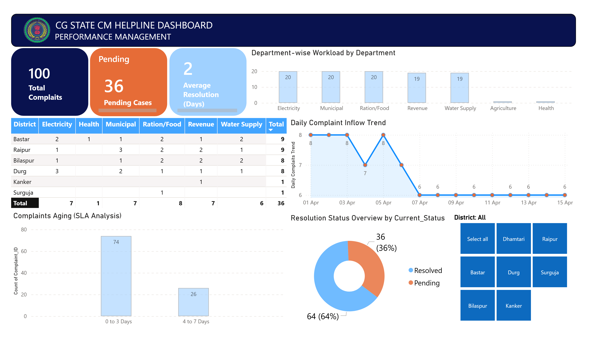

# 🏛️ Chhattisgarh State CM Helpline Dashboard: Performance & Governance Analytics

An end-to-end data analytics and business intelligence project designed to monitor, analyze, and optimize citizen grievance redressal performance for the Chhattisgarh State CM Helpline. This project builds a complete data pipeline—from structural database management to automated ETL cleaning and executive dashboarding.

---

## 📊 Executive Dashboard Preview
*(Note: Upload your dashboard screenshot as `dashboard_screenshot.png` in the repository to make it visible here)*

---

## 🛠️ Tech Stack & Project Architecture
*   **Database Management:** SQL Server (Data Infrastructure, Schema Definition, Metrics Tracking)
*   **Data Pipeline & ETL:** Python (Pandas) inside Jupyter Notebook for automated data imputation and structural cleaning
*   **Business Intelligence:** Power BI (DAX, Interactive Data Modeling, SLA Performance Tracking)

---

## 📁 Repository Directory
*   `cm_helpline_data_infrastructure.sql`: Contains the complete database setup, structural schemas, and foundational data insertion.
*   `data_cleaning_pipeline.ipynb`: Jupyter notebook containing the Python Pandas ETL pipeline used to clean missing values and structural inconsistencies.
*   `CM_Helpline_Clean_Data.csv`: The final, clean production-ready dataset powering the BI dashboard.
*   `CM_Helpline_Governance_Dashboard.pbix`: The final Power BI file featuring key performance indicators (KPIs), trend analysis, and regional performance matrices.

---

## 💡 Key Business Insights Delivered
1.  **Workload Distribution:** Identified that *Electricity*, *Municipal*, and *Ration/Food* departments represent the highest case volume across districts.
2.  **SLA Compliance & Aging:** Visualized structural aging of pending cases, pinpointing that 74% of unresolved issues fall within the critical 0-3 days window, allowing teams to intervene before breach.
3.  **Regional Resolution Efficiency:** Created an interactive matrix cross-referencing Districts against Departments to allow public administrators to filter by operational blockages instantly.
4.  **Inflow Forecasting Trends:** Tracked a steady daily complaint trend averaging ~1.94 days for standard resolution, optimizing administrative resource allocation.

---
**Developed by Naveen Poddar**  
*MBA in operations and data science Candidate | IT Operations & Data Analytics Enthusiast*
